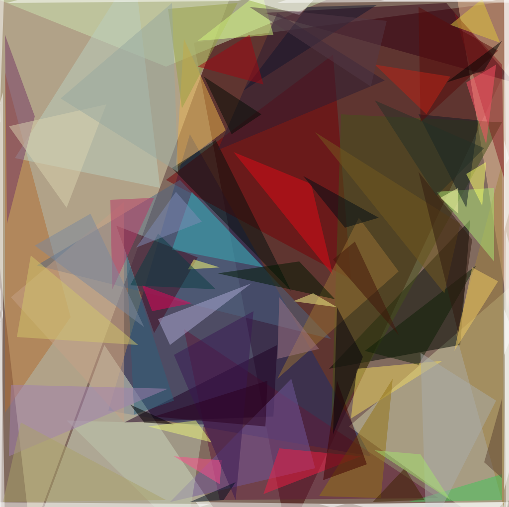

[](https://goreportcard.com/report/github.com/diop/indigo)

## Indigo
* An image transformation utility written in Go using Michael Fogleman's Primitive. `#AfroFuturism`



## What is Indigo?
Indigo is a simple utility which allows you to upload an image to a web app and it will in turn generate images based on the transformation of the intial graphical input. It will give you 4 choices. Click on the one you like and wait a few seconds to be presented with 4 variances of the one you picked from the last 4. Once you make your final decision a final larger format photo will be available for your personal use. 

## Code + Art
I've always been fascinated by generative art. I've for a long time explored Processing to see what to possibly create with it. This time around I'm came across this nice Primitive library through a tutorial on Gophercises and was delighted to find out what I could achieve with simply go and some trickery of course. 

## Getting started
You can do ```$ go get github.com/diop/indigo``` to downlaod the repo to your `$GOPATH`. Run `$ go run main.go` from within the directory then navigate to `http://locahost:3000` to view the upload page. From this page click upload image to start the process.  

## Technical concerns
For now the generated images are not deleted, but rather persisted on disk. I still have not figured out an effecient way via Go-routines to delete them after a while. So if you're thinkking about deploying it to the web please keep it into consideration. 

## Moving forward.
I truly enjoyed the Go class during this term at Make School. I could have never imagined that I would be working creating art with this backend and systems language. Now I know about basic transformation, the next logical step would be to see if a service could be built where we can automate a task like generating event flyers, on the fly, no pun intended :)


© Copyright 2019 Fodé Diop - MIT License 


